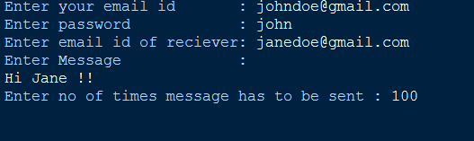

# **Send Mail**
### This is a simple program that asks user for email details and sends email

### Output:-

---

**Note:** 

1. Less secure apps option must be enabled in you email account settings.

    Eg:
For gmail go to http://shorturl.at/tLPX3 and click on allow less secure apps.

2. Note that for Non-Workspace GMail users, number of emails is restricted to 500/day.